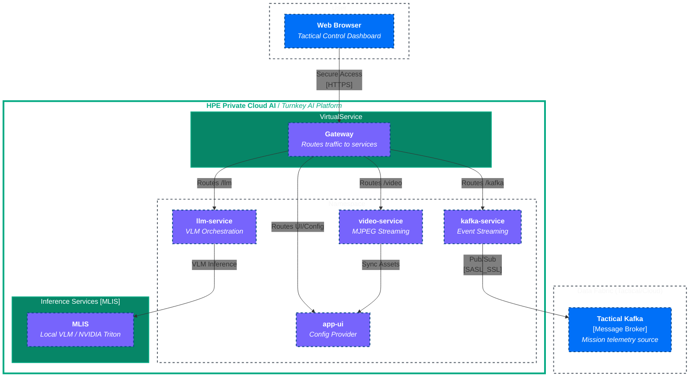

# Defence-Ops Architecture Diagram

This document provides a high-level overview of the **Defence-Ops** microservices architecture, illustrating the connections between services, external providers, and the user request flow.

## System Architecture
 

## Service Responsibilities

### 🖥️ app-ui
- **Frontend**: A Next.js-powered dashboard providing a "Global Tactical Operations Room" experience.
- **Admin Configuration**: Manages demo settings (LLM endpoints, Kafka credentials) via `/api/v1/admin/demo-config`.
- **Persistence**: Saves and loads system configuration from a shared JSON file on a Persistent Volume.

### 🤖 llm-service
- **Tactical Chat**: Handles user queries and merges them with Kafka tactical context or image/video frames.
- **Model Discovery**: Automatically discovers available `InferenceServices` in the cluster or validates external OpenAI-compatible providers.
- **Inference Integration**: Orchestrates calls to modern LLMs (e.g., Qwen, DeepSeek, Llama) for tactical analysis.

### 📡 kafka-service
- **SSE Streaming**: Provides a Server-Sent Events (SSE) endpoint at `/api/v1/kafka/stream` for real-time dashboard updates.
- **Alert Generation**: Simulations or actual production of tactical alerts to the Kafka cluster.
- **Telemetry**: Consumes raw mission data and exposes it to the UI.

### 🎥 video-service
- **Video Processing**: Serves four independent MJPEG streams representing tactical feeds.
- **VLM Readiness**: Extract sequence frames from video feeds for Vision Language Model analysis in the `llm-service`.

## Request Flow Example: Tactical Analysis

1.  **User** asks a question in the chat about "Tactical 1" feed.
2.  **app-ui** requests the latest frames for "Tactical 1" from **video-service**.
3.  **app-ui** sends the prompt + frames + recent alerts (from **kafka-service**) to **llm-service**.
4.  **llm-service** consults its configuration (fetched from **app-ui** via the internal API).
5.  **llm-service** calls the configured **Inference Endpoint** (e.g., a KServe deployment).
6.  The result is returned to the user via the dashboard.
