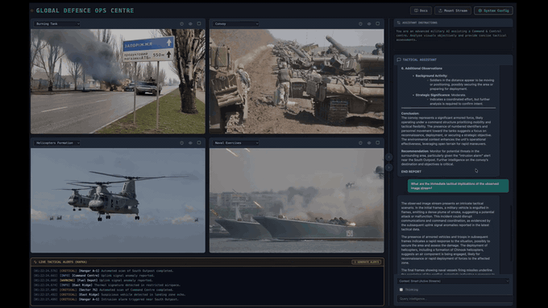
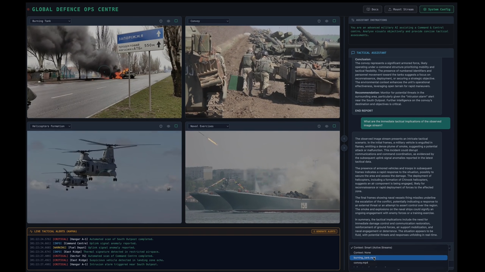
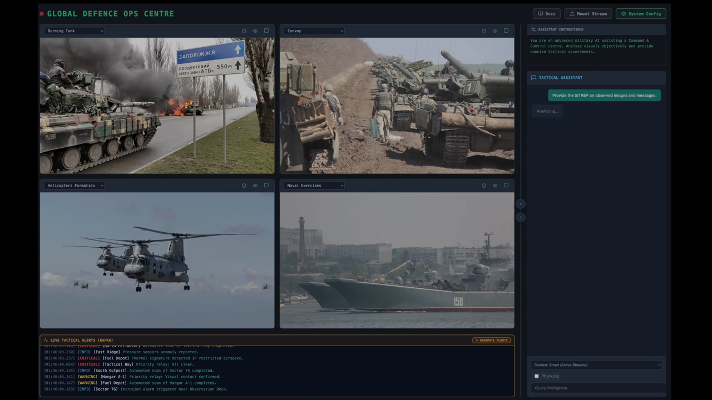
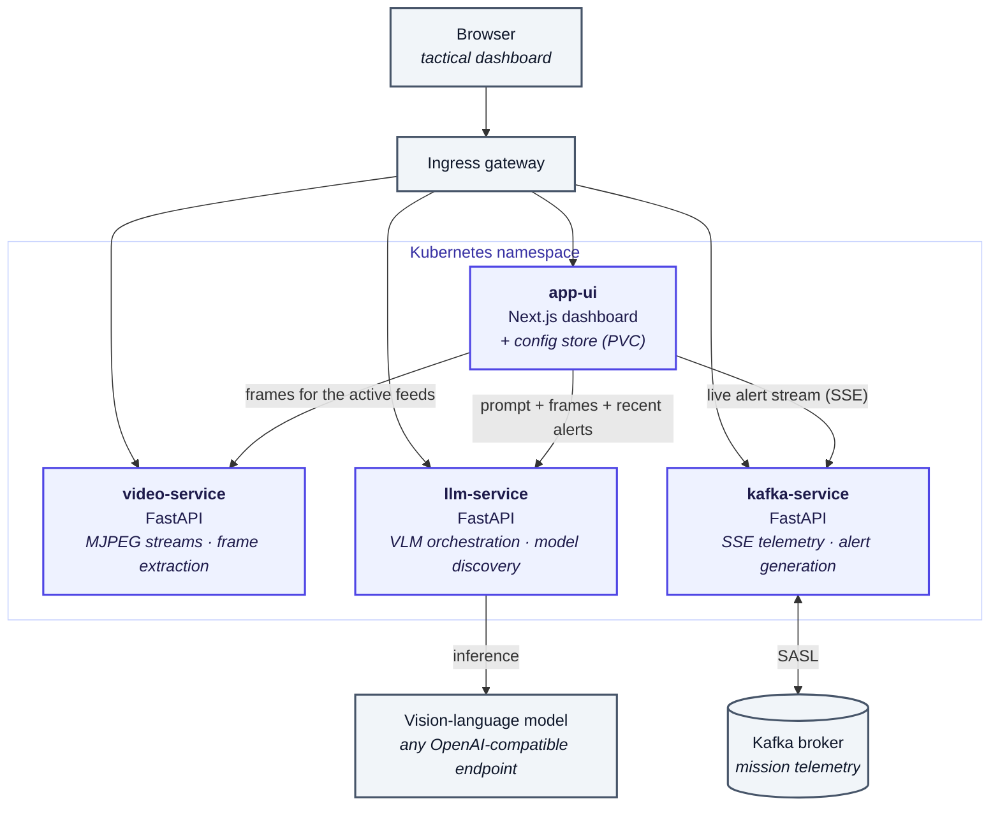

# Defence-Ops — a tactical operations centre with a vision model in the loop

An operations centre watches more video than anyone can actually watch. **Defence-Ops**
is a demo of what changes when a vision-language model watches it with you: four live
feeds in a grid, a telemetry ticker alongside them, and an assistant that answers
questions about *what is on screen right now* — "how many vehicles are in this
convoy?", "give me the SITREP across all feeds" — instead of about a document
someone wrote earlier. Every part of it runs on infrastructure you control: the model
endpoint is one you configure, the video never leaves your cluster, and there is no
external AI service in the path. It is built as a reference for anyone evaluating
private, on-premises AI for work where the footage cannot go to a public API — and as
a concrete example of wiring a multimodal model to real-time streams rather than to a
chat box.



<table>
<tr>
<td width="50%"></td>
<td width="50%"></td>
</tr>
<tr>
<td><em>The model's assessment cites what it can see in the frames it was given.</em></td>
<td><em>"Smart Context" sends frames from every playing feed plus recent telemetry in one question.</em></td>
</tr>
</table>

## How it works

Four services, each doing one job. The UI holds the configuration; the others ask it
for what they need.



A question travels: the UI pulls recent frames for whichever feeds are playing, adds
the latest telemetry, and posts the lot to `llm-service`, which forwards it to the
model endpoint you configured. [DIAGRAM.md](./DIAGRAM.md) has the detailed version.

| Service | Stack | Responsibility |
|---|---|---|
| `app-ui` | Next.js 15, React 19 | Dashboard, admin, and the shared configuration store |
| `video-service` | FastAPI | MJPEG streaming, uploads, frame extraction for inference |
| `llm-service` | FastAPI | Model discovery and vision-language inference |
| `kafka-service` | FastAPI | Telemetry over Server-Sent Events, alert generation |

## What you need

- A Kubernetes cluster, with `kubectl` and `helm` configured against it.
- **A vision-language model** on any OpenAI-compatible endpoint — the model must
  accept images, not just text. `nemotron-nano-12b-v2-vl` and `qwen3-vl:8b` both
  work well. A text-only model will deploy and then fail to describe anything.
- *Optional:* a Kafka broker for live telemetry. Without one the dashboard runs on
  generated alerts, which is enough to demo it.

This was built against [HPE Private Cloud AI](https://www.hpe.com/us/en/hpe-private-cloud-ai.html),
which supplies the cluster, the model-serving endpoints and the ingress, but nothing
here is specific to it — any cluster and any OpenAI-compatible vision endpoint will do.

## Deploy it

```bash
kubectl create namespace defence-ops

helm install defence-ops ./helm \
  --namespace defence-ops \
  --set ezua.virtualService.endpoint=defence-ops.<YOUR_DOMAIN> \
  --set global.env=production

kubectl get pods -n defence-ops -w
```

`ezua.virtualService.endpoint` is the hostname the ingress will answer on; the chart
uses it for both the route and the auth policy. The app is then at
`https://defence-ops.<YOUR_DOMAIN>`.

On HPE Private Cloud AI you can instead use its **Import Framework** wizard, which
takes a packaged chart and a logo: give it `defence-ops-<version>.tgz` and
`defence-ops.png`, and a namespace.

### First run

Open **System Config** in the navigation bar and set:

| Setting | Value |
|---|---|
| API format | `OpenAI compatible` |
| Endpoint URL | Your model endpoint |
| Model | A **vision** model, e.g. `nemotron-nano-12b-v2-vl` |
| API token | The endpoint's key |
| Kafka *(optional)* | Broker URI, username, password |

Then pick a feed in any grid cell and press play. First load of each video is slow
while it is fetched and cached; after that it is instant.

- The **eye** icon asks what objects are in the scene; the **shield** icon scans for
  threats. Both are one-click prompts.
- The chat box takes anything else. Choose **Smart Context** to ask across every
  playing feed plus recent telemetry, or scope it to one feed. **Thinking** mode
  shows the model's reasoning before its answer.

[USAGE.md](./USAGE.md) is the full walkthrough; [EXAMPLES.md](./EXAMPLES.md) has
questions that demo well.

## Development

```bash
cp .env_example .env        # set DOMAIN and KUBE_CONTEXT
tilt up                     # live-reload against your cluster
```

To publish your own images and point the chart at them:

```bash
docker login
./scripts/publish_images.sh 1.0.0
```

Then set the new tags in `helm/values.yaml`.

## Provenance, and a note on the sample videos

This demo was developed as part of my work at HPE, and the sample footage in
`assets/videos/` is included here under HPE's rights to redistribute it.

That permission does not extend to you. The clips remain third-party copyrighted
material: you may run them as part of this demo, but **not** reuse them in your
own products or redistribute them separately — see
[assets/videos/README.md](./assets/videos/README.md). For your own deployment,
substitute your own material; `video-service` picks up any `.mp4` or `.mov`
dropped in that directory, no configuration needed.

---

Demonstration software. Not a targeting system, not an operational tool, and not
built or validated for real-world military use.

© 2026 HPE. For demonstration purposes only.
